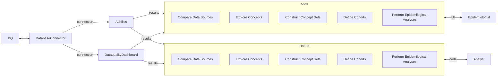

# EHR Pilot

## Table of Contents
- [Objectives](#objectives)
- [Start-up Tasks](#start-up-tasks)
- [Data Tasks](#data-tasks)
- [Investigative Tasks](#investigative-tasks)
- [Tasks for Soyoun](#tasks-for-soyoun)
- [Links](#links)
- [Tutorials](#tutorials)
- [Cervical Cancer Screening Procedures and Results](#cervical-cancer-screening-procedures-and-results)
  - [Screening Procedures (CPT Codes)](#screening-procedures-cpt-codes)
  - [Screening Results (SNOMED CT and ICD-10 Codes)](#screening-results-snomed-ct-and-icd-10-codes)

## Objectives
- Use out-of-the-box OHDSI Tools to:
  - Assess overall quality of EHR data according to OMOP CDM standards **(DataQualityDashboard)**
  - Summarize content of EHR data prior to phenotype/cohort definitions **(ACHILLES)**
  - Put the results in an explorable form for researchers **(ARES)**
  - Identify variables required for Cervical Screening Pilot **(ATHENA)**
  - Determine which of these are in our data set **(?)**

## Start-up Tasks
> “Let's start at the very beginning, a very good place to start” ~ Fraulein Maria
1. Watch [OHDSI Community Call [4/16/24]](https://www.youtube.com/watch?v=-Wovqpm7Cdc) introducing ARES and DataQualityDashboard (DQD)
2. Set up R environment according to [HADES R Setup Guide](https://ohdsi.github.io/Hades/rSetup.html)
3. Follow [DQD installation guide](https://ohdsi.github.io/DataQualityDashboard/#installation)
4. Install ACHILLES: [ACHILLES installation instructions](https://ohdsi.github.io/Achilles/#installation)
5. Install ARES: [ARES installation guide](https://ohdsi.github.io/Ares/)

## Data Tasks
1. ~~Convert PERSON_ID to Connect_ID using `link_file.csv` in GCS bucket `ehr_healthpartners` **@rebexxx** [#1](https://github.com/Analyticsphere/ehr-pilot/issues/1)~~ **[DONE]**
2. Run DQD, ACHILLES on HP data and visualize on ARES using `generate_ares_data.R` **@jacobmpeters** [#3](https://github.com/Analyticsphere/ehr-pilot/issues/3
3. Share results with Nicole

## Investigative Tasks
1. Compile list of Cervical Cancer-related concepts in CDM
2. Compile list of those concepts also present in HP data

## Tasks for Soyoun
1. ~~SQL: Count of records `n_records` per `person_id` for each table. **@moonsoyoun** [#2](https://github.com/Analyticsphere/ehr-pilot/issues/2)~~ **[DONE]**
2. ~~R: Use counts to generate a histogram. **@moonsoyoun** [#2](https://github.com/Analyticsphere/ehr-pilot/issues/2)~~ **[DONE]**

## Links
- Our documentation:
  - [EHR WG presentation](https://nih.app.box.com/file/1048412458673)
  - [CDM Document provided by HP](https://nih.app.box.com/file/1488458296044)
- CDM documentation:
  - [_OMOP CDM v5.3_ documentation](https://ohdsi.github.io/CommonDataModel/cdm53.html#person)
  - [_ATHENA_: CDM concept lookup tool](https://athena.ohdsi.org/search-terms/start)
  - [_Book of OHDSI_](https://ohdsi.github.io/TheBookOfOhdsi/)
- [_OHDSI Software Tools_](https://www.ohdsi.org/software-tools/)
  - [_HADES_: OHDSI's Health-Analytics Data to Evidence Suite](https://ohdsi.github.io/Hades/packages.html)
  - [_ACHILLES_](https://ohdsi.github.io/Achilles/)
  - [_ARES_](https://ohdsi.github.io/Ares/)
  - [_DataQualityDashboard_](https://github.com/OHDSI/DataQualityDashboard)
  - [_DatabaseConnector_](https://ohdsi.github.io/DatabaseConnector/articles/DbiAndDbplyr.html)
  - [_EHR Pilot Study_](https://nih.app.box.com/file/1048412458673)
  - [_EHR OMOP Data Definitions_](https://nih.app.box.com/file/1488458296044)
- Parallel Projects:
  - [`allofus` R package](https://roux-ohdsi.github.io/allofus/)

## Tutorials
- [Tools to Evaluate ETL](https://www.youtube.com/watch?v=-Wovqpm7Cdc) - ACHILLES, ARES, DQD
- [DevCon 2023 Workshop: Introducing Broadsea 3.0](https://www.youtube.com/watch?v=CNlsZzY7VrM)
- [ATLAS Tutorials - YouTube Playlist](https://www.youtube.com/playlist?list=PLpzbqK7kvfeUXjgnpNMFoff3PDOwv61lZ)

## OHDSI Tools Workflow

# Cervical Cancer Screening Procedures and Results

## Screening Procedures (CPT Codes)

| Procedure                                        | CPT Code | OMOP Concept ID | Description                                                                                                                              |
|--------------------------------------------------|----------|-----------------|------------------------------------------------------------------------------------------------------------------------------------------|
| Cervical Cytology (Pap Smear)                    | 88141    | 2211335         | Cytopathology, cervical or vaginal (any reporting system), requiring   interpretation by physician                                       |
|                                                  | 88142    | 2211336         | Cytopathology, cervical or vaginal (any reporting system), automated thin   layer preparation                                            |
|                                                  | 88143    | 2211337         | Cytopathology, cervical or vaginal (any reporting system), manual   screening under physician supervision                                |
|                                                  | 88147    | 2211338         | Cytopathology, cervical or vaginal, smears, any reporting system,   screening and interpretation                                         |
|                                                  | 88148    | 2211339         | Cytopathology, cervical or vaginal, smears, any reporting system, manual   screening and interpretation                                  |
| HPV Testing                                      | 87624    | 40757218        | Detection of human papillomavirus (HPV), high-risk types (e.g., 16, 18)   by nucleic acid (DNA or RNA)                                   |
|                                                  | 87625    | 40757219        | Detection of human papillomavirus (HPV), types 16 and 18 only, by nucleic   acid (DNA or RNA)                                            |
| Endocervical Curettage                           | 57505    | 2211340         | Endocervical curettage (not done as part of a dilation and curettage)                                                                    |
| Colposcopy                                       | 57454    | 2211341         | Colposcopy of the cervix including upper/adjacent vagina; with biopsy(s)   of the cervix and endocervical curettage                      |
| Cervical Biopsy                                  | 57500    | 2211342         | Biopsy of the cervix, single or multiple                                                                                                 |
|                                                  | 57455    | 2211343         | Colposcopy of the cervix including upper/adjacent vagina; with biopsy(s)   of the cervix                                                 |
| Cervical Cone Biopsy                             | 57520    | 2211344         | Conization of cervix, with or without fulguration, with or without   dilation and curettage, with or without repair; cold knife or laser |
| LEEP (Loop Electrosurgical Excision   Procedure) | 57522    | 2211345         | Loop electrode excision procedure                                                                                                        |
| Cryotherapy                                      | 57511    | 2211346         | Cryosurgery of the cervix; initial or subsequent                                                                                         |
| Hysterectomy                                     | 58150    | 2211347         | Total abdominal hysterectomy (corpus and cervix), with or without removal   of tube(s), with or without removal of ovary(s)              |
|                                                  | 58260    | 2211348         | Vaginal hysterectomy                                                                                                                     |
## Screening Results (SNOMED CT and ICD-10 Codes)

| Result                                                          | Code Type | Code            | OMOP Concept ID | Description                                                   |
|-----------------------------------------------------------------|-----------|-----------------|-----------------|---------------------------------------------------------------|
| Insufficient/Inadequate                                         | SNOMED CT | 261091000000105 | 44804384        | Inadequate specimen                                           |
| NILM (Negative for Intraepithelial Lesion   or Malignancy)      | SNOMED CT | 428763004       | 4299857         | NILM (Negative for Intraepithelial Lesion or Malignancy)      |
| ASC-US (Atypical Squamous Cells of   Undetermined Significance) | SNOMED CT | 33791000119105  | 4299858         | ASC-US (Atypical Squamous Cells of Undetermined Significance) |
| LSIL (Low-Grade Squamous Intraepithelial   Lesion)              | SNOMED CT | 35901000119100  | 4299859         | LSIL (Low-Grade Squamous Intraepithelial Lesion)              |
| ASC-H (Atypical Squamous Cells cannot   exclude HSIL)           | SNOMED CT | 33786000119102  | 4299860         | ASC-H (Atypical Squamous Cells cannot exclude HSIL)           |
| HSIL (High-Grade Squamous Intraepithelial   Lesion)             | SNOMED CT | 13602000119105  | 4299861         | HSIL (High-Grade Squamous Intraepithelial Lesion)             |
| SCC (Squamous Cell Carcinoma)                                   | SNOMED CT | 16356006        | 4024666         | Squamous Cell Carcinoma                                       |
| HPV Positive                                                    | SNOMED CT | 278300000       | 373121          | HPV Positive                                                  |
| HPV Negative                                                    | SNOMED CT | 278290009       | 373118          | HPV Negative                                                  |

# Diabetes prevalence: Cross-validate EHR and Self-reported Data

Diabetes Questions:
  - _Are EHR data and self-reported data aligned/as expected?_
    - Define concept sets for EHR and surveys
    - Compare self-reported incidence rates to EHR rates
    - Look at Hemoglobin A1C results
    - Look at medication exposures: metformin, insulin, etc.

## Diabetes-Related Codes

| ID              | CODE      | NAME                                 | CLASS            | CONCEPT      | VALIDITY | DOMAIN      | VOCAB  |
|-----------------|-----------|--------------------------------------|------------------|--------------|----------|-------------|--------|
|        201820   | 73211009  | Diabetes   mellitus                  | Disorder         | Standard     | Valid    | Condition   | SNOMED |
| 4024659         | 11687002  | Gestational   diabetes mellitus      | Disorder         | Standard     | Valid    | Condition   | SNOMED |
| 201254          | 46635009  | Type   1 diabetes mellitus           | Disorder         | Standard     | Valid    | Condition   | SNOMED |
| 201826          | 44054006  | Type   2 diabetes mellitus           | Disorder         | Standard     | Valid    | Condition   | SNOMED |
|        45566732 | E13       | Other   specified diabetes mellitus  | ICD10 Hierarchy  | Non-standard | Valid    | Condition   | ICD10  |
|        40475049 | E10-E14   | Diabetes   mellitus                  | ICD10 SubChapter | Non-standard | Valid    | Condition   | ICD10  |
|        45534186 | O24       | Diabetes   mellitus in pregnancy     | ICD10 Hierarchy  | Non-standard | Valid    | Condition   | ICD10  |
| 45566732        | E13       | Other   specified diabetes mellitus  | ICD10 Hierarchy  | Non-standard | Valid    | Condition   | ICD10  |
| 45576436        | E10       | Type   1 diabetes mellitus           | ICD10 Hierarchy  | Non-standard | Valid    | Condition   | ICD10  |
| 45571656        | E11       | Type   2 diabetes mellitus           | ICD10 Hierarchy  | Non-standard | Valid    | Condition   | ICD10  |
|                 |           |                                      |                  |              |          |             |        |
|        4184637  | 43396009  | Hemoglobin   A1c measurement         | Procedure        | Standard     | Valid    | Measurement | SNOMED |
|        4012477  | 113076002 | Glucose   tolerance test             | Procedure        | Standard     | Valid    | Measurement | SNOMED |
|        4156660  | 271062006 | Fasting   blood glucose measurement  | Procedure        | Standard     | Valid    | Measurement | SNOMED |
| 4041725         | 167096006 | Plasma   fasting glucose measurement | Procedure        | Standard     | Valid    | Measurement | SNOMED |
| 4041723         | 167087006 | Serum   fasting glucose measurement  | Procedure        | Standard     | Valid    | Measurement | SNOMED |

| conceptId | Current Source Question                                                                                                                                 | conceptId | Current Question Text                                                                           | conceptId | Current Format/Value |
|-----------|---------------------------------------------------------------------------------------------------------------------------------------------------------|-----------|-------------------------------------------------------------------------------------------------|-----------|----------------------|
| 900541533 | Thyroid, Diabetes, Graves - Has a doctor or other health professional ever told you that you have or had any of these conditions? Select all that apply | 158044532 | Diabetes                                                                                        |           |                      |
|           |                                                                                                                                                         | 494032093 | Which type of diabetes did a doctor or other health professional tell you that you have or had? | 146477090 | 0 = Type 1           |
| 301679110 | How old were you when a doctor or other health professional first told you that you have or had Diabetes?                                               | 206625031 | Age at diagnosis                                                                                |           |                      |
| 301679110 | How old were you when a doctor or other health professional first told you that you have or had Diabetes?                                               | 261863326 | Year at diagnosis                                                                               |           |                      |

#### How to Obtain Variables

## Meeting Notes
see [MEETING_NOTES.md](https://github.com/Analyticsphere/ehr-pilot/blob/main/MEETING_NOTES.md)

