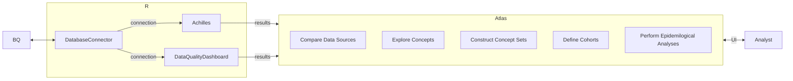

# EHR Pilot

## Meeting Notes
As of Nov. 2024, all EHR-pilot meeting notes and EHR Infrastructure Setup will be documented on the [GH Wiki](https://github.com/Analyticsphere/ehr-pilot/wiki) associated with this repository. 

## Project Management
All major tasks will be be tracked as [GH Issues](https://github.com/Analyticsphere/ehr-pilot/issues) and will be managed in the associated [GH Project](https://github.com/orgs/Analyticsphere/projects/11/views/1) punchlist/kanban board.

## Objectives
- Use out-of-the-box OHDSI Tools to:
  - Assess overall quality of EHR data according to OMOP CDM standards **(DataQualityDashboard)**
  - Summarize content of EHR data prior to phenotype/cohort definitions **(ACHILLES)**
  - Put the results in an explorable form for researchers **(ARES)** or **(ATLAS)**
  - Identify variables required for Cervical Screening Pilot **(ATHENA)**
    - Define modular **concept sets** related to cervical cancer diagnoses, cervical cancer screening, screening results, etc.
    - Define priliminary **phenotype** using these
    - Compare phenotype accross sites using some sort of standardized reporting tool (in ATLAS? or ARES?)  

## Start-up Tasks
1. Watch [OHDSI Community Call [4/16/24]](https://www.youtube.com/watch?v=-Wovqpm7Cdc) introducing ARES and DataQualityDashboard (DQD)
2. Set up R environment according to [HADES R Setup Guide](https://ohdsi.github.io/Hades/rSetup.html)
3. Follow [DQD installation guide](https://ohdsi.github.io/DataQualityDashboard/#installation)
4. Install ACHILLES: [ACHILLES installation instructions](https://ohdsi.github.io/Achilles/#installation)
5. Install ARES: [ARES installation guide](https://ohdsi.github.io/Ares/)

## Links
- Our documentation:
  - [EHR WG presentation](https://nih.app.box.com/file/1048412458673)
  - [CDM Document provided by HP](https://nih.app.box.com/file/1488458296044)
- CDM documentation:
  - [_OMOP CDM v5.3_ documentation](https://ohdsi.github.io/CommonDataModel/cdm53.html#person)
  - [_ATHENA_: CDM concept lookup tool](https://athena.ohdsi.org/search-terms/start)
  - [_Book of OHDSI_](https://ohdsi.github.io/TheBookOfOhdsi/)
- [_OHDSI Software Tools_](https://www.ohdsi.org/software-tools/)
  - [_HADES_: OHDSI's Health-Analytics Data to Evidence Suite](https://ohdsi.github.io/Hades/packages.html)
  - [_ACHILLES_](https://ohdsi.github.io/Achilles/)
  - [_ARES_](https://ohdsi.github.io/Ares/)
  - [_DataQualityDashboard_](https://github.com/OHDSI/DataQualityDashboard)
  - [_DatabaseConnector_](https://ohdsi.github.io/DatabaseConnector/articles/DbiAndDbplyr.html)
  - [_EHR Pilot Study_](https://nih.app.box.com/file/1048412458673)
  - [_EHR OMOP Data Definitions_](https://nih.app.box.com/file/1488458296044)
- Parallel Projects:
  - [`allofus` R package](https://roux-ohdsi.github.io/allofus/)

## Tutorials
- [Tools to Evaluate ETL](https://www.youtube.com/watch?v=-Wovqpm7Cdc) - ACHILLES, ARES, DQD
- [DevCon 2023 Workshop: Introducing Broadsea 3.0](https://www.youtube.com/watch?v=CNlsZzY7VrM)
- [ATLAS Tutorials - YouTube Playlist](https://www.youtube.com/playlist?list=PLpzbqK7kvfeUXjgnpNMFoff3PDOwv61lZ)

## OHDSI Tools Workflow

